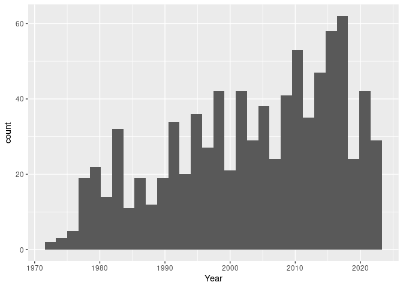

Analysis
================

``` r
library(tidyverse)
library(broom)
library(readxl)
#install.packages("dplyr")
library(dplyr)
library(ggplot2)
#install.packages("leaflet")
library(leaflet)
#install.packages("htmltools")
library(htmltools)
```

## 1. Introduction

## 2. Data

``` r
Internships <- read_excel("/cloud/project/data/Internship_Program.xlsx", 
    col_types = c("text", "text", "numeric", 
        "text", "text", "text", "numeric", 
        "numeric", "text", "text"))
```

    ## Warning: Expecting numeric in C12 / R12C3: got '2001, 2002'

    ## Warning: Expecting numeric in C14 / R14C3: got '2002 - 2009'

    ## Warning: Expecting numeric in C64 / R64C3: got '1979 and 1980'

    ## Warning: Expecting numeric in C73 / R73C3: got '1994-95'

    ## Warning: Expecting numeric in C74 / R74C3: got '1997, 1998'

    ## Warning: Expecting numeric in C81 / R81C3: got '1996-2008'

    ## Warning: Expecting numeric in C94 / R94C3: got '1995, 1996'

    ## Warning: Expecting numeric in C101 / R101C3: got '1973, 1974, 1975'

    ## Warning: Expecting numeric in C145 / R145C3: got '1984, 1985'

    ## Warning: Expecting numeric in C204 / R204C3: got '2017-18'

    ## Warning: Expecting numeric in C233 / R233C3: got '1981, 1982'

    ## Warning: Expecting numeric in C234 / R234C3: got '1981-1983'

    ## Warning: Expecting numeric in C236 / R236C3: got 'NA'

    ## Warning: Expecting numeric in C237 / R237C3: got '2015, 2016'

    ## Warning: Expecting numeric in C263 / R263C3: got '2009-2011'

    ## Warning: Expecting numeric in C270 / R270C3: got '2006, 2007'

    ## Warning: Expecting numeric in C287 / R287C3: got '2009-2010'

    ## Warning: Expecting numeric in C471 / R471C3: got '1974, 1975'

    ## Warning: Expecting numeric in C472 / R472C3: got '1997, 1998, 1999'

    ## Warning: Expecting numeric in C480 / R480C3: got '1978, 1979, 1980'

    ## Warning: Expecting numeric in C481 / R481C3: got '1994, 1995, 1996'

    ## Warning: Expecting numeric in C492 / R492C3: got '1985, 1986'

    ## Warning: Expecting numeric in C509 / R509C3: got '2015, 2016, 2017'

    ## Warning: Expecting numeric in C516 / R516C3: got '2003, 2004, 2005'

    ## Warning: Expecting numeric in C522 / R522C3: got 'NA'

    ## Warning: Expecting numeric in C527 / R527C3: got '1987-1993'

    ## Warning: Expecting numeric in C532 / R532C3: got '1977, 1978'

    ## Warning: Expecting numeric in C712 / R712C3: got 'NA'

    ## Warning: Expecting numeric in C713 / R713C3: got 'NA'

    ## Warning: Expecting numeric in C714 / R714C3: got 'NA'

    ## Warning: Expecting numeric in C715 / R715C3: got 'NA'

    ## Warning: Expecting numeric in C716 / R716C3: got '≤2000'

    ## Warning: Expecting numeric in C717 / R717C3: got 'NA'

    ## Warning: Expecting numeric in C718 / R718C3: got 'NA'

    ## Warning: Expecting numeric in C721 / R721C3: got 'NA'

    ## Warning: Expecting numeric in C723 / R723C3: got 'NA'

    ## Warning: Expecting numeric in C724 / R724C3: got 'NA'

    ## Warning: Expecting numeric in C725 / R725C3: got 'NA'

    ## Warning: Expecting numeric in C726 / R726C3: got 'NA'

    ## Warning: Expecting numeric in C727 / R727C3: got 'NA'

    ## Warning: Expecting numeric in C728 / R728C3: got 'NA'

    ## Warning: Expecting numeric in C729 / R729C3: got 'NA'

    ## Warning: Expecting numeric in C730 / R730C3: got 'NA'

    ## Warning: Expecting numeric in C731 / R731C3: got 'NA'

    ## Warning: Expecting numeric in C732 / R732C3: got 'NA'

    ## Warning: Expecting numeric in C733 / R733C3: got 'NA'

    ## Warning: Expecting numeric in C734 / R734C3: got 'NA'

    ## Warning: Expecting numeric in C735 / R735C3: got 'NA'

    ## Warning: Expecting numeric in C736 / R736C3: got 'NA'

    ## Warning: Expecting numeric in C737 / R737C3: got 'NA'

    ## Warning: Expecting numeric in C738 / R738C3: got 'NA'

    ## Warning: Expecting numeric in C739 / R739C3: got 'NA'

    ## Warning: Expecting numeric in C740 / R740C3: got 'NA'

    ## Warning: Expecting numeric in C741 / R741C3: got 'NA'

    ## Warning: Expecting numeric in C742 / R742C3: got 'NA'

    ## Warning: Expecting numeric in C743 / R743C3: got 'NA'

    ## Warning: Expecting numeric in C744 / R744C3: got 'NA'

    ## Warning: Expecting numeric in C745 / R745C3: got 'NA'

    ## Warning: Expecting numeric in C746 / R746C3: got 'NA'

    ## Warning: Expecting numeric in C747 / R747C3: got 'NA'

    ## Warning: Expecting numeric in C748 / R748C3: got 'NA'

    ## Warning: Expecting numeric in C749 / R749C3: got 'NA'

    ## Warning: Expecting numeric in C750 / R750C3: got 'NA'

    ## Warning: Expecting numeric in C751 / R751C3: got 'NA'

    ## Warning: Expecting numeric in C752 / R752C3: got 'NA'

    ## Warning: Expecting numeric in C753 / R753C3: got 'NA'

    ## Warning: Expecting numeric in C754 / R754C3: got 'NA'

    ## Warning: Expecting numeric in C755 / R755C3: got 'NA'

    ## Warning: Expecting numeric in C756 / R756C3: got 'NA'

    ## Warning: Expecting numeric in C757 / R757C3: got 'NA'

    ## Warning: Expecting numeric in C758 / R758C3: got 'NA'

    ## Warning: Expecting numeric in C759 / R759C3: got 'NA'

    ## Warning: Expecting numeric in C760 / R760C3: got 'NA'

    ## Warning: Expecting numeric in C761 / R761C3: got 'NA'

    ## Warning: Expecting numeric in C762 / R762C3: got 'NA'

    ## Warning: Expecting numeric in C763 / R763C3: got 'NA'

    ## Warning: Expecting numeric in C764 / R764C3: got 'NA'

    ## Warning: Expecting numeric in C765 / R765C3: got 'NA'

    ## Warning: Expecting numeric in C766 / R766C3: got 'NA'

    ## Warning: Expecting numeric in C767 / R767C3: got 'NA'

    ## Warning: Expecting numeric in C768 / R768C3: got 'NA'

    ## Warning: Expecting numeric in C769 / R769C3: got 'NA'

    ## Warning: Expecting numeric in C770 / R770C3: got 'NA'

    ## Warning: Expecting numeric in C772 / R772C3: got '1987, 1988'

    ## Warning: Expecting numeric in C782 / R782C3: got 'Varied'

    ## Warning: Expecting numeric in G782 / R782C7: got 'NA'

    ## Warning: Expecting numeric in H782 / R782C8: got 'NA'

    ## Warning: Expecting numeric in C851 / R851C3: got 'NA'

    ## Warning: Expecting numeric in C900 / R900C3: got a date

    ## Warning: Expecting numeric in C905 / R905C3: got 'NA'

    ## Warning: Expecting numeric in C922 / R922C3: got 'NA'

    ## Warning: Expecting numeric in C953 / R953C3: got 'NA'

``` r
head(Internships)
```

    ## # A tibble: 6 × 10
    ##   Name    Term   Year `Internship Site` Title (if applicable…¹ Location Latitude
    ##   <chr>   <chr> <dbl> <chr>             <chr>                  <chr>       <dbl>
    ## 1 Brodie… Spri…  1997 Z Studio Graphic… Graphic Artist Inern   Bar Har…     44.4
    ## 2 Atonde… Spri…  2022 Citizens Inc.     Accounting Specialist  Austin …     30.3
    ## 3 Decker… Wint…  1994 National Organiz… Administrative Assist… Boston,…     42.4
    ## 4 Bossea… Summ…  1995 Camp Chewonki     Adminstrative Assista… Wiscass…     44.0
    ## 5 Cohn, … Fall   1987 Alliance for Cul… Adminstrative Assista… Champai…     40.1
    ## 6 Bell, … Summ…  2018 Maine Maritime A… Admissions Intern      Blue Hi…     44.4
    ## # ℹ abbreviated name: ¹​`Title (if applicable)`
    ## # ℹ 3 more variables: Longitude <dbl>, `Notes (if any)` <chr>,
    ## #   `Notes on Location` <chr>

``` r
glimpse(Internships)
```

    ## Rows: 953
    ## Columns: 10
    ## $ Name                    <chr> "Brodie, Laura", "Atondeh, Gloria", "Decker, S…
    ## $ Term                    <chr> "Spring", "Spring", "Winter", "Summer", "Fall"…
    ## $ Year                    <dbl> 1997, 2022, 1994, 1995, 1987, 2018, 1985, 2010…
    ## $ `Internship Site`       <chr> "Z Studio Graphic Design", "Citizens Inc.", "N…
    ## $ `Title (if applicable)` <chr> "Graphic Artist Inern", "Accounting Specialist…
    ## $ Location                <chr> "Bar Harbor, Maine", "Austin Texas", "Boston, …
    ## $ Latitude                <dbl> 44.38764, 30.27113, 42.35543, 44.00255, 40.116…
    ## $ Longitude               <dbl> -68.2043361, -97.7436995, -71.0605110, -69.664…
    ## $ `Notes (if any)`        <chr> NA, NA, NA, NA, NA, NA, "In Navy blue Bar Harb…
    ## $ `Notes on Location`     <chr> NA, NA, NA, NA, NA, NA, NA, NA, NA, NA, NA, NA…

I think this delim does not work because I already read in the data for
Year as numeric. That already took out the ones with multiple years. But
if I do not read it in as numeric, I get lots of problems later on, so
maybe we should just make the data more suitable? The leaflet would show
just one year column anyways, so why not pick the first year given to us
before reading in the data. How relevant is it that they stayed at the
site for 2-3 years? Most of them are from a long time ago anyways.

``` r
#Internships %>%
  #filter(is.na(Year) == FALSE, Year != "NA") %>%
  #separate_longer_delim(Year, delim = ", ")
```

## 3. Data analysis plan

General analysis of data

``` r
Internships |>
  filter(as.numeric(Year) %in% 1973:2023) |>
ggplot(aes(x = Year)) +
  geom_histogram()
```

    ## `stat_bin()` using `bins = 30`. Pick better value with `binwidth`.

<!-- -->

There are 237 distinct titles for people’s internships. The entries
should be checked for spelling errors, such as Reaserch instead of
Research. They should also be grouped, e.g. farm apprentice, farm
assistant, farm hand, farm intern. Make it more explicit when people
fill out the internship report to choose from a couple of specific
options that e.g. do not contain the type of institution (“Farm”).

``` r
Internships %>%
  group_by( `Title (if applicable)`) %>%
  count() %>%
  arrange(desc(n))
```

    ## # A tibble: 243 × 2
    ## # Groups:   Title (if applicable) [243]
    ##    `Title (if applicable)`     n
    ##    <chr>                   <int>
    ##  1 Intern                    517
    ##  2 Research Assistant         66
    ##  3 NA                         60
    ##  4 Student Teacher            12
    ##  5 Apprentice                  5
    ##  6 Assistant                   5
    ##  7 Field Assistant             5
    ##  8 Teacher Assistant           5
    ##  9 Camp Counselor              4
    ## 10 Farm Apprentice             4
    ## # ℹ 233 more rows

# Leaflet

``` r
labels <- sprintf("<strong>%s</strong><br/> %s<br/> %s", 
                  Internships$`Internship Site`, Internships$Location, Internships$Year) |>
  lapply(htmltools::HTML)
```

``` r
leaflet() %>%
  addTiles() %>%
  addMarkers(data = Internships,
              label = labels) 
```
